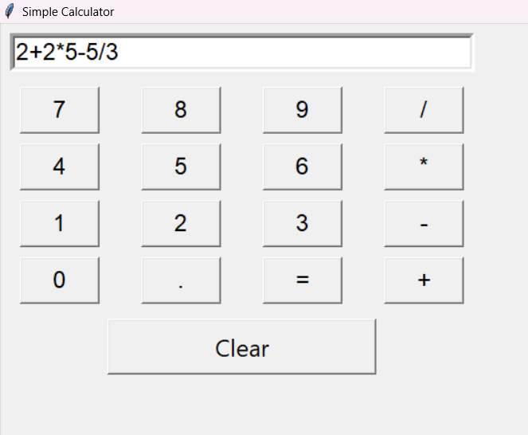
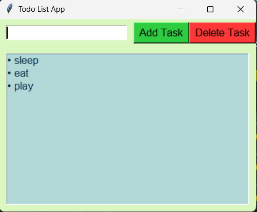
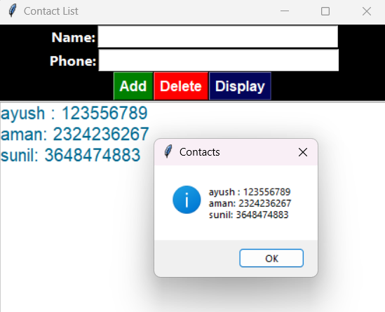

# CODSOFT Python Internship

This repository contains the Python projects completed during my CODSOFT Python Programming Internship.

---

##  Calculator

A GUI calculator built using Python and Tkinter.

### Features
- Addition
- Subtraction
- Multiplication
- Division
- Keyboard support

### Screenshot

---

##  To-Do List

A task management application.

### Features
- Add tasks
- Delete tasks
- Save tasks

### Screenshot

---

##  Contact Book

A contact management system.

### Features
- Add contacts
- Search contacts
- Update contacts
- Delete contacts

### Screenshot

---

##  Technologies Used

- Python
- Tkinter
- SQLite

---

## 👨‍💻 Author

**Ayush Kumar Jha**

GitHub: https://github.com/ayushkumarjha1
